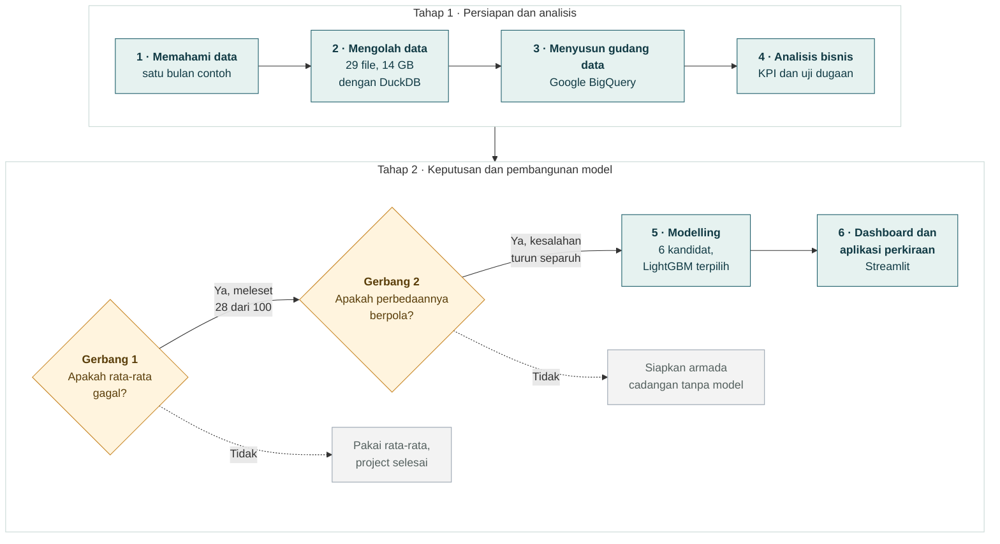

# Perkiraan Permintaan Ride-Hailing di New York City

[](https://nyc-ride-hailing.streamlit.app)

Project ini menganalisis **589 juta perjalanan Uber dan Lyft** di New York City selama Januari 2024 – Mei 2026, lalu membangun model yang **memperkirakan berapa banyak perjalanan akan terjadi di setiap zona, setiap jam, hingga 4 pekan ke depan**. Hasilnya disajikan dalam **dashboard analisis** dan **aplikasi perkiraan** berbasis web yang bisa dicoba siapa saja tanpa memasang apa pun.

**Buka dashboard dan aplikasi perkiraan:** https://nyc-ride-hailing.streamlit.app

---

## Daftar isi

1. [Ringkasan dalam satu menit](#ringkasan-dalam-satu-menit)
2. [Konteks bisnis](#konteks-bisnis)
3. [Alur pengerjaan](#alur-pengerjaan)
4. [Tools yang digunakan](#tools-yang-digunakan)
5. [Temuan utama analisis bisnis](#temuan-utama-analisis-bisnis)
6. [Temuan utama modelling](#temuan-utama-modelling)
7. [Rekomendasi](#rekomendasi)
8. [Dashboard dan aplikasi perkiraan](#dashboard-dan-aplikasi-perkiraan)
9. [Cara menjalankan sendiri](#cara-menjalankan-sendiri)
10. [Keterbatasan dan pengembangan berikutnya](#keterbatasan-dan-pengembangan-berikutnya)
11. [Kamus istilah](#kamus-istilah)

---

## Ringkasan dalam satu menit

Bayangkan kamu mengelola ribuan pengemudi taksi online. Setiap jam kamu harus memutuskan: **berapa pengemudi yang dibutuhkan, kapan, dan di mana?** Kalau terlalu sedikit, penumpang menunggu lama dan pindah ke aplikasi lain. Kalau terlalu banyak, pengemudi menganggur dan penghasilannya turun.

| Pertanyaan | Jawaban dari project ini |
|---|---|
| Apakah rata-rata cukup untuk merencanakan armada? | **Tidak.** Rata-rata per zona per jam meleset 28 dari setiap 100 perjalanan |
| Apakah pola permintaan bisa dipelajari? | **Ya.** Memakai pola mingguan saja sudah mengurangi kesalahan hampir separuh |
| Seberapa bagus model yang dibangun? | Meleset **16 dari setiap 100 perjalanan** (tepat sekitar 84%), dengan kesalahan **14% lebih sedikit** daripada cara terbaik tanpa model |
| Sejauh apa perkiraan bisa dipercaya? | Hingga **4 pekan ke depan**, dengan ketepatan hampir sama dengan perkiraan 1 pekan ke depan |

---

## Konteks bisnis

### Latar belakang

Operasi ride-hailing pada dasarnya adalah keputusan tentang **penempatan**: berapa kendaraan yang perlu tersedia, pada jam berapa, di zona mana.

Masalahnya, jumlah pengemudi tidak bisa disesuaikan setelah pesanan datang. Pengemudi yang berjarak 20 menit bukan solusi bagi penumpang yang memesan sekarang. Kendaraan harus sudah berada di dekat lokasi **sebelum** permintaan muncul. Karena itu seluruh operasi berjalan di atas **antisipasi**, dan antisipasi membutuhkan angka untuk dituju.

### Rumusan masalah

Ada perbedaan tingkat antara tempat keputusan diambil dan tempat laporan dibuat:

```
Keputusan diambil di   : zona × jam
Laporan dibuat di      : seluruh kota × bulan
```

Rata-rata hanya bisa mewakili kelompoknya bila isi kelompok itu mirip satu sama lain. Bila isinya sangat berbeda, rata-rata tetap terlihat wajar padahal kondisi sebenarnya jauh berbeda. **Yang belum diketahui: seberapa besar perbedaan di balik angka rata-rata itu.**

Masalah ini juga tidak terlihat dengan sendirinya:

| Bila perencanaan salah | Yang terjadi | Kenapa tidak terlihat di laporan |
|---|---|---|
| Armada kurang | Permintaan tidak terlayani | Pesanan yang gagal tidak tercatat di data |
| Armada berlebih | Pengemudi menganggur | Tidak ada data waktu menganggur pengemudi |

Laporan bulanan tetap terlihat sehat pada kedua kondisi. Masalahnya bukan tidak terjadi, melainkan **tidak terukur**.

### Pertanyaan bisnis

> **Pertanyaan utama:** pada tingkat rincian mana rata-rata masa lalu berhenti dapat dipercaya sebagai dasar perencanaan?

| # | Pertanyaan pendukung |
|---|---|
| 1 | Apakah pertumbuhan permintaan nyata, setelah pengaruh kalender dibersihkan? |
| 2 | Apakah perubahan angka rata-rata mencerminkan perubahan komponen penyusunnya? |
| 3 | Apakah pola jam ramai berlaku sama di seluruh zona? |
| 4 | Apakah Uber dan Lyft bergerak searah di setiap zona? |
| 5 | Seberapa besar rata-rata meleset di tingkat zona per jam? |

### Tujuan

**Tujuan bisnis**

> Menyediakan armada pada waktu dan lokasi yang tepat, sehingga permintaan terlayani tanpa membuat pengemudi menganggur.

Project ini **tidak dapat mencapai tujuan itu sepenuhnya**, karena merencanakan armada juga membutuhkan data ketersediaan pengemudi yang tidak ada di data publik. Yang disediakan project ini adalah **fondasinya**: perkiraan permintaan yang lebih tepat daripada rata-rata.

**Tujuan analisis**

| Kode | Tujuan | Status |
|---|---|---|
| G1 | Menetapkan KPI yang relevan dan memetakan mana yang bisa dihitung dari data | Tercapai |
| G2 | Menguji apakah rata-rata mewakili kondisi di tingkat keputusan | Tercapai: rata-rata terbukti gagal |
| G3 | Menguji apakah perbedaan antar jam dan zona punya pola yang bisa dipelajari | Tercapai: polanya terbukti ada |
| G4 | Menetapkan pembanding untuk model | Tercapai: meniru pekan lalu, meleset 22,1 dari 100 |
| G5 | Menentukan di mana perkiraan paling bernilai | Tercapai: 360 kombinasi zona dan provider yang menampung 95% permintaan |

**Tujuan modelling**

> Memperkirakan jumlah perjalanan per **jam × provider × zona penjemputan** dengan kesalahan lebih kecil daripada pembanding pada G4.

Ukuran keberhasilannya bukan angka ketepatan mutlak, melainkan **apakah model lebih baik daripada cara yang bisa dipakai tanpa model**.

**KPI utama:** jumlah perjalanan per zona per jam per provider. Angka inilah yang langsung menentukan berapa armada dibutuhkan, kapan, dan di mana.

### Yang bukan tujuan

| Bukan tujuan | Alasan |
|---|---|
| Mengatur alokasi pengemudi | Tidak ada data jumlah dan kesibukan pengemudi |
| Memperkirakan seluruh keinginan memesan | Data hanya memuat perjalanan yang terlayani |
| Merekomendasikan harga | Tidak ada data biaya maupun kepekaan penumpang terhadap harga |
| Menghitung keuntungan | Selisih tarif dan pendapatan pengemudi bukan keuntungan perusahaan |
| Mengatur pesanan secara langsung | Data diolah per bulan, bukan seketika |

---

## Alur pengerjaan



Pengerjaan dibagi dua tahap. **Tahap 1** menyiapkan data dan menganalisisnya. **Tahap 2** memutuskan apakah model perlu dibangun, lalu membangunnya. Kotak hijau adalah langkah pengerjaan, kotak kuning adalah **gerbang**, dan kotak abu-abu adalah tempat project akan berhenti bila gerbangnya tidak lolos. Kedua gerbang itu adalah bagian terpenting. Membangun model butuh usaha, sedangkan rata-rata bisa dipakai gratis. Jadi model hanya layak dibangun bila dua hal terbukti lebih dulu: rata-rata memang gagal, **dan** perbedaannya punya pola yang bisa dipelajari. Kalau salah satu gagal, project berhenti di situ. Keduanya diuji dengan analisis biasa, bukan dengan membangun model, karena menguji perlunya model dengan membangun model adalah penalaran melingkar.

| Langkah | Notebook | Yang dikerjakan | Hasil |
|---|---|---|---|
| 1 | [`01_data_understanding_january_2024.ipynb`](01_data_understanding_january_2024.ipynb) | Mengenali isi dan kualitas data dari satu bulan contoh | Daftar kolom yang bisa dipakai dan aturan pembersihan |
| 2 | [`02_data_pipeline_2024_2026.ipynb`](02_data_pipeline_2024_2026.ipynb) | Mengolah 29 file bulanan dengan DuckDB di laptop | Ringkasan per zona per jam, 589 juta perjalanan menjadi 10 juta baris |
| 3 | [`03_bigquery_transformation.ipynb`](03_bigquery_transformation.ipynb) | Menyusun tabel analisis di Google BigQuery | Tabel siap pakai untuk permintaan, bisnis, dan tujuan perjalanan |
| 4 | [`04_business_analytics.ipynb`](04_business_analytics.ipynb) | Menetapkan KPI, menguji 7 dugaan bisnis, dan menguji dua gerbang | Temuan, rekomendasi bisnis, dan pembanding untuk model |
| 5 | [`05_modelling.ipynb`](05_modelling.ipynb) | Membandingkan 6 kandidat model, menguji model terpilih, menyusun batas bawah dan atas | Model LightGBM dan perkiraan 1–28 Juni 2026 |
| 6 | [`app/app.py`](app/app.py) | Menyajikan temuan dalam dashboard dan perkiraan dalam aplikasi perkiraan | [nyc-ride-hailing.streamlit.app](https://nyc-ride-hailing.streamlit.app) |

Laporan lengkapnya ada di [`Laporan_Project_Ride_Hailing_Revisi.md`](Laporan_Project_Ride_Hailing_Revisi.md).


---

## Tools yang digunakan

| Kategori | Tools | Dipakai untuk |
|---|---|---|
| **Bahasa dan lingkungan kerja** | Python, Jupyter Notebook, VS Code, Anaconda | Menulis seluruh analisis dan kode dalam lima notebook |
| **Pengolahan data besar** | DuckDB | Mengolah 29 file bulanan (14 GB, 589 juta perjalanan) langsung di laptop, tanpa server |
| **Format data** | Apache Parquet, PyArrow | Menyimpan data dalam format ringkas dan cepat dibaca |
| **Gudang data** | Google BigQuery (Sandbox) | Menyusun tabel analisis siap pakai dengan SQL |
| **Analisis data** | pandas, NumPy | Mengolah, menggabungkan, dan menghitung data di notebook |
| **Visualisasi di notebook** | Matplotlib | Grafik analisis bisnis dan hasil model |
| **Model perkiraan** | LightGBM | Model terpilih untuk memperkirakan permintaan per zona per jam |
| **Model pembanding** | XGBoost, regresi linear | Kandidat lain yang dibandingkan sebelum LightGBM dipilih |
| **Dashboard dan aplikasi perkiraan** | Streamlit, Altair | Membangun dashboard analisis bisnis dan aplikasi perkiraan yang interaktif |
| **Hosting** | Streamlit Community Cloud | Menjalankan dashboard dan aplikasi perkiraan secara online dan gratis |
| **Versi kode dan dokumentasi** | Git, GitHub | Menyimpan kode, riwayat perubahan, dan dokumentasi project |

## Temuan utama analisis bisnis

### Hasil dua gerbang

**Gerbang 1: apakah rata-rata gagal? Ya.**
Rata-rata per zona per jam meleset **28 dari setiap 100 perjalanan**, dan secara keseluruhan menebak **5,9% terlalu rendah** karena tidak menangkap pertumbuhan. Lebih dari separuh jam yang diperkirakan ternyata lebih ramai dari rata-ratanya.

**Gerbang 2: apakah perbedaannya berpola? Ya.**
Semakin banyak pola waktu yang dipakai, semakin kecil kesalahannya:

| Cara memperkirakan | Meleset per 100 perjalanan |
|---|---|
| Rata-rata per zona saja | 44 |
| Rata-rata per zona, dibedakan per jam | 28 |
| Meniru jam yang sama pekan lalu | 22 |

Hanya dengan memakai pola mingguan, kesalahan turun **dari 44 menjadi 22**, atau separuhnya. Artinya perbedaan antar jam dan zona bukan acak, dan layak dipelajari oleh model.

### Hasil uji dugaan bisnis

Sebelum melihat data, disusun beberapa dugaan yang umum dipercaya. Setiap dugaan lalu diuji dengan data.

| # | Dugaan awal | Hasil | Bukti |
|---|---|---|---|
| 1 | Permintaan terpusat di sedikit zona | **Tidak terbukti** | 10 zona teratas hanya 12,9% perjalanan; butuh 58 zona untuk separuhnya |
| 2 | Ada satu jam ramai untuk seluruh kota | **Tidak terbukti** | Zona terbagi tiga: ramai pagi (15%), sore (42%), dan malam (42%) |
| 3 | Uber dan Lyft bergerak searah | **Terbukti sebagian** | Pembagiannya mirip antar zona, tetapi pangsa Uber turun di 93% zona |
| 4 | Rata-rata cukup untuk perencanaan | **Tidak terbukti** | Meleset 28 dari 100; cara berpola hanya 22 |
| 5 | Pendapatan pengemudi menurun | **Tidak terbukti** | Pendapatan per menit naik 7,6% |
| 6 | Kenaikan tarif kecil | **Tidak terbukti** | Tarif per mil naik 11,5%, jauh di atas tarif per perjalanan (7,2%) |
| 7 | Kemacetan menjelaskan lamanya perjalanan | **Terbukti sebagian** | Kecepatan turun 3,3%, tetapi hanya di 2026; lama perjalanan hampir tetap karena jaraknya juga makin pendek |
| 8 | Akhir pekan adalah Sabtu dan Minggu | **Tidak terbukti** | Jumat dan Sabtu yang paling berbeda dari hari lain |
| 9 | Asal dan tujuan perjalanan seimbang | **Tidak terbukti** | Penn Station dan JFK menerima 22% lebih banyak penumpang daripada yang berangkat |
| 10 | Minat berbagi tumpangan stabil | **Tidak terbukti** | Di Uber turun dari 5,1 menjadi 2,5 per 100 perjalanan |

### Enam temuan terpenting

| Temuan | Artinya bagi bisnis |
|---|---|
| **Permintaan tersebar, tidak terpusat.** 10 zona teratas hanya 12,9% perjalanan | Armada harus direncanakan per zona, bukan untuk seluruh kota sekaligus |
| **Jam ramai berbeda di tiap zona.** Pola jam rata-rata kota hanya cocok untuk 42% zona | Jadwal pengemudi perlu berbeda untuk zona yang ramai pagi, sore, dan malam |
| **Akhir pekan yang sebenarnya adalah Jumat–Sabtu.** Sabtu 36% lebih ramai dari Senin; Jumat dan Sabtu malam 2,3–2,6 kali lebih ramai dari malam Senin–Kamis | Program insentif akhir pekan sebaiknya dimulai Jumat |
| **Permintaan terus tumbuh.** Naik 5,9% per hari dibanding dua tahun sebelumnya, dan makin cepat sejak Oktober 2025 | Perencanaan yang hanya melihat masa lalu akan selalu kekurangan armada |
| **Tarif naik lebih cepat dari yang terlihat.** Per mil naik 11,5% karena perjalanan juga makin pendek, dan pemendekan ini terjadi di 80% zona | Kenaikan harga tidak terlihat bila hanya melihat tarif per perjalanan |
| **Stasiun dan bandara lebih banyak menerima daripada mengirim penumpang** | Pengemudi yang mengantar ke sana perlu diarahkan ke zona lain agar tidak kembali kosong |

---

## Temuan utama modelling

### Model mana yang dipilih?

Enam kandidat dibandingkan pada **tiga periode uji berbeda** (April–Juni, Juli–September, dan Oktober–Desember 2025), agar pilihannya tidak bergantung pada satu periode kebetulan.

| Kandidat | Meleset per 100 perjalanan |
|---|---|
| **LightGBM, satu model untuk semua zona** | **14,87** (terpilih) |
| LightGBM ditambah informasi tahun lalu | 14,84 |
| XGBoost | 14,99 |
| LightGBM, model terpisah untuk Uber dan Lyft | 14,99 |
| LightGBM, model terpisah per kelompok keramaian | 15,06 |
| Regresi linear | 16,47 |
| *Pembanding: rata-rata 4 pekan terakhir* | *16,64* |

Empat kandidat teratas hampir sama baiknya, sehingga dipilih **yang paling sederhana**. Pilihan ini terbukti tepat: di data uji, versi dengan informasi tahun lalu justru lebih buruk (16,31 dibanding 16,02).

### Seberapa bagus hasilnya?

Model diuji pada **Januari–Mei 2026**, data yang sama sekali tidak dilihat saat model belajar. Sebelum setiap bulan, model dilatih ulang dengan data terbaru, seperti saat dipakai sungguhan.

| Cara memperkirakan | Meleset per 100 perjalanan | Kira-kira tepat |
|---|---|---|
| **Model LightGBM** | **16,0** | **84%** |
| Rata-rata jam yang sama, 4 pekan terakhir | 18,5 | 81,5% |
| Meniru jam yang sama pekan lalu | 21,3 | 78,7% |
| Rata-rata jam yang sama, 2024–2025 | 27,1 | 72,9% |

- **Kesalahan model 14% lebih sedikit** daripada cara terbaik tanpa model, dan **25% lebih sedikit** daripada meniru pekan lalu. Tujuan modelling tercapai
- **Unggul di jam sibuk** (17:00–22:00): meleset 15,8 dibanding 18,0 per 100
- **Unggul di setiap kelompok zona**, dari yang paling ramai (14,8 dibanding 17,4) sampai yang paling sepi (20,2 dibanding 22,3)
- **Konsisten dari pekan ke pekan**: tidak pernah kalah di zona ramai dan menengah, dan hanya kalah 2 dari 22 pekan di zona sepi
- **Pola mingguan tertangkap sepenuhnya**: setelah dikurangi perkiraan model, sisa kesalahan tidak lagi berulang tiap pekan
- **Cenderung sedikit terlalu rendah**, sekitar 1,4% di bawah kenyataan secara keseluruhan, kemungkinan karena permintaan sedang tumbuh

> **Kenapa tidak 100% tepat?** Yang diperkirakan sangat rinci: satu zona, satu provider, satu jam. Di tingkat serinci itu banyak jam yang hanya berisi belasan perjalanan, sehingga selisih 2–3 perjalanan saja sudah tercatat sebagai meleset cukup besar. Yang terpenting adalah model **lebih baik daripada cara yang bisa dipakai tanpa model**.

### Temuan penting selama membangun model

| Temuan | Pelajaran |
|---|---|
| Informasi "urutan hari sejak awal data" membuat perkiraan **7,2% terlalu tinggi** | Model jenis ini membawa tingkat musim ramai ke bulan yang lebih sepi; informasi itu dibuang |
| Jumlah perjalanan 1 pekan sebelumnya adalah petunjuk **paling mirip**, bahkan lebih mirip dari 1 jam sebelumnya | Pola mingguan adalah pola terkuat dalam permintaan |
| Melatih ulang setiap bulan hanya mengurangi kesalahan **0,04 dari setiap 100** | Pola permintaan stabil; melatih ulang setiap 3 bulan sudah cukup |
| Memisah model per provider atau per kelompok zona **tidak membantu** | Satu model untuk semua zona membuat zona sepi ikut belajar dari zona ramai |

### Seberapa jauh ke depan?

| Perkiraan untuk | Model | Rata-rata 4 pekan | Meniru hari yang sama sebelumnya |
|---|---|---|---|
| 7 hari ke depan | 16,01 | 18,49 | 21,34 |
| 14 hari ke depan | 16,62 | 19,23 | 23,34 |
| 28 hari ke depan | 16,59 | 19,77 | 23,98 |

Perkiraan untuk **4 pekan ke depan hampir sama baiknya** dengan 1 pekan ke depan: kesalahannya hanya bertambah 0,6 dari setiap 100. Selisih dengan cara tanpa model justru melebar.

### Batas bawah dan atas

Setiap perkiraan disertai batas bawah dan batas atas dengan target: 8 dari 10 kali jumlah sebenarnya berada di antaranya. Hasil ujinya jujur perlu disampaikan:

| Tingkat | Tepat berada di antara kedua batas | Catatan |
|---|---|---|
| Satu zona-provider per jam | 77,6% | Stabil 80% sejak Maret 2026 |
| Seluruh kota per hari | 72,2% | Hanya 38,7% di Januari, tetapi 93,5% di Mei |

Januari–Februari 2026 berisi hari-hari dengan penurunan ekstrem yang tidak bisa diperkirakan tanpa data cuaca. Karena itu **angka perkiraan utama tetap dapat dipercaya**, sedangkan batas bawah dan atas dibaca sebagai **kisaran dalam kondisi normal**.

### Perkiraan Juni 2026

| Pekan | Perkiraan perjalanan di seluruh kota | Kisaran normal |
|---|---|---|
| 1–7 Juni | 4,89 juta | 4,65 – 5,30 juta |
| 8–14 Juni | 4,90 juta | 4,64 – 5,36 juta |
| 15–21 Juni | 4,83 juta | 4,59 – 5,26 juta |
| 22–28 Juni | 4,90 juta | 4,65 – 5,33 juta |

---

## Rekomendasi

### Rekomendasi bisnis

| Rekomendasi | Dasar | Status |
|---|---|---|
| **1. Rencanakan armada dengan perkiraan per zona dan jam, bukan rata-rata** | Rata-rata meleset 28 dari 100 | **Tercapai.** Model meleset 16,0 dari 100 dan lebih baik di setiap kelompok zona |
| **2. Bedakan hari dan kelompok zona dalam perencanaan** | Jumat–Sabtu berbeda dari hari lain; zona terbagi kelompok pagi, sore, dan malam | **Diterapkan.** Menjadi informasi yang dipakai model |
| **3. Perhitungkan arah perpindahan mobil** | Stasiun dan bandara menerima hingga 22% lebih banyak penumpang daripada yang berangkat | **Belum.** Menjadi pengembangan berikutnya |

### Rekomendasi pemakaian model

1. **Pakai perkiraan 1 pekan ke depan** untuk menempatkan pengemudi, dan **perkiraan 2–4 pekan ke depan** untuk jadwal shift dan program insentif
2. **Siapkan pengemudi sampai batas atas** di jam dan zona yang mahal bila kekurangan, misalnya Jumat–Sabtu malam dan bandara, karena model cenderung sedikit terlalu rendah
3. **Latih ulang model setiap 3 bulan**, dan pantau kesalahannya setiap bulan. Bila model tidak lagi lebih baik dari rata-rata 4 pekan, latih ulang lebih awal
4. **Tambahkan data cuaca dan kejadian besar**, sumber kesalahan terbesar saat ini

---

## Dashboard dan aplikasi perkiraan

Keduanya dibangun dengan Streamlit dan bisa dibuka di satu alamat: [nyc-ride-hailing.streamlit.app](https://nyc-ride-hailing.streamlit.app). Setiap halaman dilengkapi panduan cara menggunakan.

| Bagian | Halaman | Isi |
|---|---|---|
| **Dashboard** | Dashboard | Angka utama, tren per bulan, jam dan hari paling ramai, zona teramai, perubahan tarif dan pendapatan pengemudi. Bisa disaring per periode, provider, dan wilayah |
| **Aplikasi perkiraan** | Perkiraan kota | Perkiraan seluruh kota untuk 4 pekan ke depan, per pekan dan per hari |
| | Perkiraan per zona | Pilih zona, provider, dan tanggal untuk melihat perkiraan setiap jam. Hasilnya bisa diunduh ke Excel |
| | Peringkat zona | Zona mana yang paling ramai pada tanggal dan jam tertentu, misalnya Sabtu malam |
| | Keandalan model | Seberapa sering model tepat, dibanding cara tanpa model, lengkap dengan penjelasan |
| **Keterangan** | Tentang | Data, cara kerja, keputusan, rekomendasi, dan istilah |

---|---|
| **Dashboard** | Angka utama, tren per bulan, jam dan hari paling ramai, zona teramai, perubahan tarif dan pendapatan pengemudi. Bisa disaring per periode, provider, dan wilayah |
| **Perkiraan kota** | Perkiraan seluruh kota untuk 4 pekan ke depan, per pekan dan per hari |
| **Perkiraan per zona** | Pilih zona, provider, dan tanggal untuk melihat perkiraan setiap jam. Hasilnya bisa diunduh ke Excel |
| **Peringkat zona** | Zona mana yang paling ramai pada tanggal dan jam tertentu, misalnya Sabtu malam |
| **Keandalan model** | Seberapa sering model tepat, dibanding cara tanpa model, lengkap dengan penjelasan |
| **Tentang** | Data, cara kerja, keputusan, rekomendasi, dan istilah |

---

## Cara menjalankan sendiri

### Data

**NYC TLC High Volume For-Hire Vehicle Trip Records**, data resmi dan terbuka dari Komisi Taksi dan Limusin New York: Januari 2024 – Mei 2026, 589.055.372 perjalanan Uber dan Lyft di 263 zona penjemputan. Data mentahnya sekitar 14 GB sehingga **tidak disimpan di repository ini**; unduh dari [nyc.gov/site/tlc/about/tlc-trip-record-data.page](https://www.nyc.gov/site/tlc/about/tlc-trip-record-data.page).

### Hanya dashboard dan aplikasi perkiraannya (paling mudah)

Semua data yang dibutuhkan dashboard dan aplikasi perkiraan sudah ada di folder `app/data`.

```bash
git clone https://github.com/aoramaaulia-collab/NYC-Ride-Hailing-Demand-Forecasting.git
cd NYC-Ride-Hailing-Demand-Forecasting
pip install -r app/requirements.txt
streamlit run app/app.py
```

Jalankan perintah terakhir dari folder utama project agar tema tampilannya terbaca.

### Seluruh project dari awal

1. Unduh 29 file High Volume For-Hire Vehicle Trip Records (Januari 2024 – Mei 2026) dan simpan di folder `data/raw/`
2. Jalankan notebook 01 sampai 05 secara berurutan. Paket yang dibutuhkan setiap notebook tercantum di sel awalnya. Notebook 03 membutuhkan akun Google Cloud dengan BigQuery
3. Siapkan ulang data dashboard dan aplikasi perkiraan dengan `python app/siapkan_data_app.py .`

Beberapa file besar hasil perantara, seperti fitur model (sekitar 200 MB per file), tidak disimpan di repository ini dan akan dibuat ulang oleh notebook.

### Struktur folder

```
NYC-Ride-Hailing-Demand-Forecasting/
├── 01_ ... 05_*.ipynb        Lima notebook, dari memahami data sampai modelling
├── Laporan_Project_...md     Laporan lengkap project
├── app/
│   ├── app.py                Dashboard dan aplikasi perkiraan (Streamlit)
│   ├── siapkan_data_app.py   Menyiapkan data ringkas untuk dashboard dan aplikasi perkiraan
│   ├── requirements.txt      Paket Python yang dibutuhkan
│   └── data/                 Data ringkas untuk dashboard dan aplikasi perkiraan
├── .streamlit/config.toml    Tema tampilan
├── data/staging/             Ringkasan per bulan hasil langkah 2
└── output/
    ├── final/                Data gabungan 2024–2026 untuk analisis
    ├── dashboard/            Data ringkas untuk dashboard
    └── model/                Hasil penilaian model dan perkiraan
```

---

## Keterbatasan dan pengembangan berikutnya

**Keterbatasan**

- **Hanya perjalanan yang terjadi yang tercatat.** Orang yang batal memesan karena tidak ada pengemudi tidak masuk data, sehingga yang diperkirakan adalah permintaan yang **terlayani**
- **Tidak ada data cuaca dan kejadian besar.** Hari dengan penurunan ekstrem tidak bisa diperkirakan
- **Tidak ada data pengemudi**, sehingga project ini memperkirakan permintaan, bukan mengatur alokasi pengemudi
- **Data TLC dirilis sekitar dua bulan setelah bulannya berakhir.** Perkiraan Juni 2026 adalah **demonstrasi kemampuan model**, bukan perkiraan operasional langsung

**Pengembangan berikutnya**

- Menambahkan data cuaca dan kalender acara besar
- Memperkirakan arah perpindahan penumpang antar zona
- Menjalankan seluruh proses secara otomatis setiap ada data baru
- Menyiapkan pengaturan model tersendiri untuk perkiraan 2–4 pekan ke depan

---

## Kamus istilah

| Istilah | Artinya |
|---|---|
| **Ride-hailing** | Layanan pemesanan kendaraan lewat aplikasi, seperti Uber dan Lyft |
| **Zona** | Pembagian wilayah New York City oleh TLC; ada 263 zona penjemputan |
| **Provider** | Perusahaan penyedia layanan, di sini Uber atau Lyft |
| **KPI** | Angka utama yang perubahannya memicu keputusan bisnis |
| **Gerbang** | Syarat yang harus terbukti sebelum project boleh berlanjut ke tahap berikutnya |
| **Meleset per 100 perjalanan** | Dari setiap 100 perjalanan yang benar-benar terjadi, berapa yang tidak tertebak. Di notebook disebut **WMAPE** |
| **Kesalahan X% lebih sedikit** | Perbandingan dua cara. 16,0 dibanding 18,5 berarti kesalahan model 14% lebih sedikit, **bukan** ketepatan 14% |
| **Pembanding** | Cara sederhana tanpa model, dipakai untuk membuktikan bahwa model memang berguna |
| **Batas bawah dan batas atas** | Kisaran perkiraan. Dalam kondisi normal, 8 dari 10 kali jumlah sebenarnya berada di antaranya |
| **LightGBM** | Jenis model pembelajaran mesin yang menyusun banyak aturan sederhana secara bertahap untuk membuat perkiraan |
| **Data uji** | Data yang disembunyikan dari model saat belajar, dipakai untuk menilai perkiraannya secara jujur |

---

## Tentang pembuat

**Aulia Aorama**
GitHub: [@aoramaaulia-collab](https://github.com/aoramaaulia-collab)

Data bersumber dari NYC Taxi and Limousine Commission dan bersifat terbuka untuk umum.
